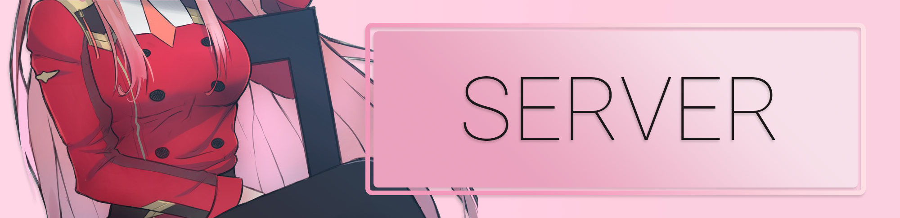

# ZeroTwoBot
### Designed and created by:
[pinnouse](https://github.com/pinnouse/ZeroTwoBot)

[](https://travis-ci.com/pinnouse/ZeroTwoBot) [](https://david-dm.org/pinnouse/ZeroTwoBot) [](https://www.codacy.com/app/pinnouse/ZeroTwoBot)

[](https://z2b.xyz)
[](https://discord.gg/XZXD2gU)
<sup>Zero Two Art: [ErosPanda via Pixiv](https://www.pixiv.net/member_illust.php?mode=medium&illust_id=68239359)</sup>

### Table of Contents
[Description](#description)<br />
[Features](#features)<br />
[Self-Hosting](#self-hosting)<br />
[Contact](#contact)<br />
[License](#license)

## Description
You have come across my wonderful, beautiful Discord bot. Based off the star darling in the anime: Darling in the FranXX, this bot is packed to the brim with unfinished functionality.
<br />
<br />
Working and functioning, not like the super bestest, but it sorta kinda maybe works.
<br />
Built using the [DiscordJS](https://discord.js.org) library.

## Features
### (or lack thereof)
- Music (youtube)
- Chatbot
- 8 Ball
- Anime (AniList)
- Osu! (Players, WIP)
- League of Legends (WIP)

For a full list of commands, visit the website: [here](https://z2b.xyz/commands)

## Self-Hosting
### Installation

Prerequisites:
- [ffmpeg](https://www.ffmpeg.org)
- [nodejs](https://nodejs.org)

### Configuration
The bot requires a configuration file named ` config.json ` to be placed in the root directory.
<br />
Example (do not include the `"// ..."`):

```js
{
    "prefix"      : "?", //Default prefix, change if you want
    "homeUrl"     : "OPTIONAL_HOME_URL", //Website URL for RichEmbed author links
    "token"       : "DISCORD_BOT_TOKEN", //https://discordapp.com/developers
    "gapi"        : "GOOGLE_API_KEY", //YouTube functionality
    "oapi"        : "OSU_API_KEY", //osu! functionality
    "owners"      : ["ARRAY_OF_OWNER_IDS (can be obtained by doing '\@username#tag'"], //So you can use the kill command
    "chatbotUrl"  : "https://chat.owo.soy", //Configured like Amadeus (https://github.com/pinnouse/amadeus)
    "chatbotAuth" : "Basic YOUR_AUTH_TOKEN", //Contact to inquire about obtaining a token
    "serverPort"  : 8080, //Port for the builtin backend HTML server
    "accessKey"   : "SECRET", //Set a key to keep the bot server safe, passed as a GET 'key=' argument
    "defaultLang" : "en", //Set to whichever language is supported (found in ./locales/)
    "edit_commands": false //If someone edits a message, and if it's a valid command, execute it. Set to true if you want to use it
}
```

### Testing
If testing the bot, the script you should use is: `npm run dev`
<br />
**Note:** This requires you to have in your ` config.json `:

```js
{
    ...
    "testToken": "DISCORD_BOT_TOKEN"
    ...
}
```
If no `testToken` is specified, the `token` value will be used instead.

## Contact

> **Discord (main contact):** `pinnouse#7766`
>
> **Support Channel:** [invite](https://discord.gg/XZXD2gU)
>
> **Home Website:** [link](https://nwong.xyz)

## License
GPL v3

[license](./LICENSE)
